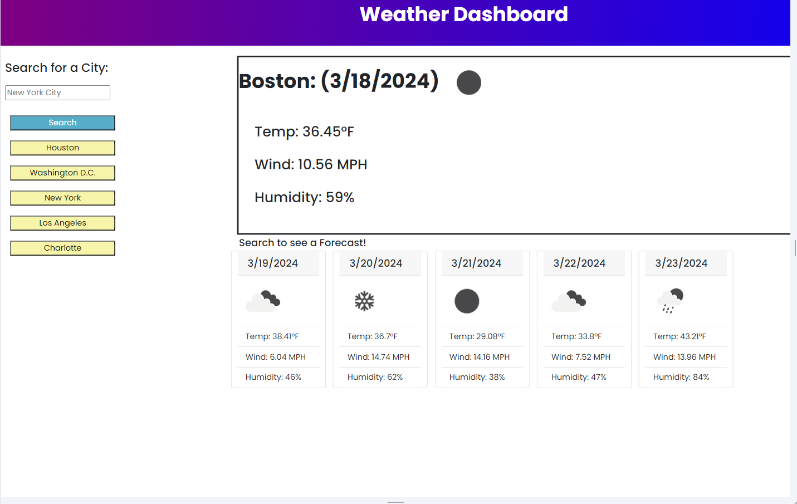

# 06 Server-Side APIs: Weather Dashboard

## Description 
We were asked to create a weather tracking website, which shows current weather and 5 day forecast based on the city we type in the search bar. We utilized openweather API to gather the information and present it on the site. 

## Site Link
https://mikef13x.github.io/weather-app/

## Screenshot

## Notes

I worked with Kayla Freeman on parts of the assignment, as well as a tutor to help with parts of the JavaScript.
